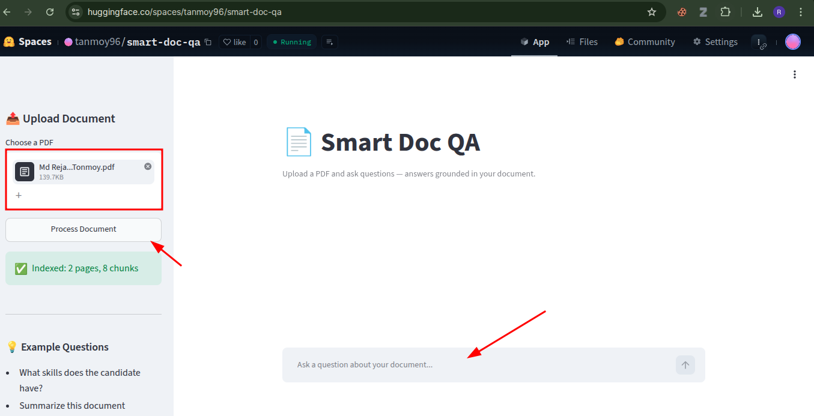
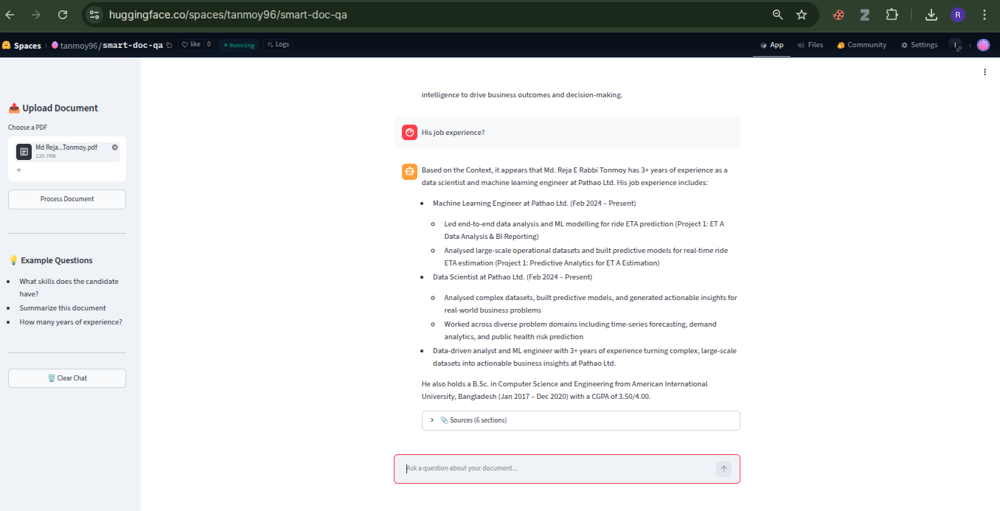

# 📄 Smart Doc QA
 
A **RAG-based document Q&A system** that lets you upload any PDF (English or Bengali) and ask questions in natural language — getting accurate, source-grounded answers powered by semantic search and an LLM.
 
🔗 **Live Demo:** [huggingface.co/spaces/tanmoy96/smart-doc-qa](https://huggingface.co/spaces/tanmoy96/smart-doc-qa)
 
---
 
##  Overview
 
Smart Doc QA solves a common problem: extracting precise answers from long documents without reading them end-to-end. Upload a PDF, ask a question, and the system retrieves the most relevant sections and generates a grounded answer — with citations showing exactly where the answer came from.
 
Built as an end-to-end Retrieval-Augmented Generation (RAG) pipeline, it demonstrates the full lifecycle: document ingestion, chunking, embedding, vector storage, semantic retrieval, query rewriting, and LLM generation — served through a decoupled API and a clean chat interface.
 
---
 
## How to Use
 
1. **Upload a PDF** from the sidebar.
2. **Click the "Process Document" button** — wait for the `Indexed` confirmation. *(This step is required before chatting — it builds the searchable index.)*
3. **Start asking questions** in the chat box at the bottom.

 
---
 
## Example in Action
 
Ask anything about the document and get a structured, source-cited answer:
 

 
---
 
##  Features
 
- **Natural-language Q&A** over any uploaded PDF
- **Multilingual support** — handles both English and Bengali documents
- **Source citations** — every answer shows which document sections grounded it
- **Conversational memory** — understands follow-up questions ("his experience?", "are you sure?")
- **Query rewriting** — expands vague or context-dependent questions for better retrieval
- **Hallucination control** — answers strictly from document content; says so when an answer isn't found
- **Responsive chat UI** — works on desktop, tablet, and mobile
---
 
##  Architecture
 
```
┌─────────────┐     HTTP/REST    ┌──────────────────┐
│  Streamlit  │ ───────────────► │     FastAPI       │
│  Frontend   │                  │     Backend       │
│  (chat UI)  │ ◄─────────────── │   /upload  /ask   │
└─────────────┘      JSON        └────────┬─────────┘
                                          │
                          ┌───────────────▼────────────────┐
                          │         RAG Pipeline            │
                          │                                 │
                          │  PDF → Chunk → Embed → ChromaDB │
                          │           ↓                     │
                          │  Query Rewrite → Retrieve →     │
                          │  Augment → LLM (Groq) → Answer  │
                          └─────────────────────────────────┘
```
 
The system uses a **decoupled architecture**: a FastAPI backend exposes the RAG pipeline as a REST API, while a Streamlit frontend provides the user interface. This separation mirrors production patterns and keeps the retrieval logic independent of the presentation layer.
 
---
 
##  Tech Stack
 
| Component | Technology |
|-----------|-----------|
| **Orchestration** | LangChain |
| **Vector Database** | ChromaDB |
| **Embeddings** | HuggingFace `paraphrase-multilingual-MiniLM-L12-v2` (local, free) |
| **LLM** | Groq — Llama 3.1 (OpenAI-compatible) |
| **Backend API** | FastAPI + Uvicorn |
| **Frontend** | Streamlit |
| **Deployment** | Docker on Hugging Face Spaces |
 
---
 
##  How It Works
 
1. **Ingestion** — The PDF is loaded and split into overlapping chunks (`RecursiveCharacterTextSplitter`, 1000 chars, 200 overlap) to preserve context across boundaries.
2. **Embedding** — Each chunk is converted into a vector using a multilingual sentence-transformer model that runs locally (no API cost).
3. **Storage** — Vectors are stored in ChromaDB for fast similarity search.
4. **Query rewriting** — Incoming questions are rewritten into standalone, expanded search queries using conversation history, improving retrieval recall.
5. **Retrieval** — The top-k most semantically similar chunks are fetched via cosine similarity.
6. **Generation** — Retrieved context is passed to the LLM with a strict prompt that grounds the answer in the document and prevents hallucination.
---
 
## Setup
 
```bash
# Clone the repository
git clone https://github.com/T0N-M0Y/smart-doc-qa
cd smart-doc-qa
 
# Create and activate a virtual environment
python -m venv venv
source venv/bin/activate
 
# Install dependencies
pip install -r requirements.txt
 
# Add your Groq API key
cp .env.example .env
# then edit .env and set GROQ_API_KEY
```
 
### Run locally
 
The system runs as two services. Open two terminals:
 
```bash
# Terminal 1 — backend
uvicorn app:app --reload
 
# Terminal 2 — frontend
streamlit run streamlit_app.py
```
 
Visit `http://localhost:8501` to use the app, or `http://localhost:8000/docs` for the interactive API documentation.
 
---
 
##  Project Structure
 
```
smart-doc-qa/
├── src/
│   ├── loader.py         # PDF loading + chunking
│   ├── embeddings.py     # multilingual embedding model
│   ├── vectorstore.py    # ChromaDB management
│   └── rag.py            # query rewriting + RAG pipeline
├── app.py                # FastAPI backend
├── streamlit_app.py      # Streamlit frontend (local, calls API)
├── app_hf.py             # standalone Streamlit app (deployment)
├── Dockerfile            # container for Hugging Face Spaces
├── requirements.txt
└── README.md
```
 
---
 
##  Known Limitations & Future Work
 
RAG systems involve inherent trade-offs. Documented limitations and planned improvements:
 
- **Single-document scope** — currently indexes one document at a time; multi-document support via metadata filtering is a natural next step.
- **Retrieval recall** — vague queries can occasionally miss relevant chunks; query rewriting mitigates but doesn't fully solve this.
- **Latency** — query rewriting adds an extra LLM call per question, trading speed for retrieval quality.
- **Planned** — answer evaluation (faithfulness / relevancy scoring), reranking, and hybrid (keyword + semantic) search.
---
 
##  Author
 
**Md. Reja E Rabbi Tonmoy** — Machine Learning Engineer
 
[GitHub](https://github.com/T0N-M0Y) • [LinkedIn](https://www.linkedin.com/in/tonmoy-md-reja-e-rabbi/)
 
---
 
## 📄 License
 
MIT
 